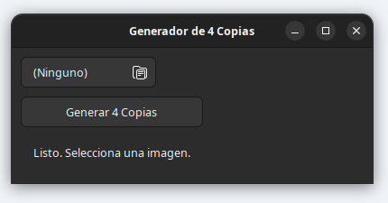

# Generador de 4 Copias por Página

 
Una pequeña aplicación de escritorio para **Linux**, construida con **Python** y **GTK3 (Glade)**, que te permite generar fácilmente un archivo **PDF** (o imagen) con 4 copias de una misma imagen dispuestas en una sola página. Es ideal para optimizar la impresión de imágenes, por ejemplo, para imprimir varias veces la misma foto carné o cualquier otra imagen que necesites duplicar en una hoja de papel.

---

## Características Principales

* **Interfaz Gráfica Sencilla:** Diseñada para ser intuitiva y fácil de usar.
* **Generación Rápida:** Crea un PDF con tus 4 copias en cuestión de segundos.
* **Optimización de Impresión:** Ahorra papel al agrupar múltiples copias en una sola hoja.
* **Basado en ImageMagick:** Utiliza esta potente herramienta para asegurar la calidad y flexibilidad en el procesamiento de imágenes.

---

## Requisitos

Para poder ejecutar esta aplicación en tu sistema Linux, asegúrate de tener instalados los siguientes componentes:

* **Python 3:** Generalmente preinstalado en la mayoría de las distribuciones.
* **PyGObject (GTK+ para Python):**
    ```bash
    sudo apt install python3-gi python3-gi-cairo gir1.2-gtk-3.0
    ```
    *(Para distribuciones basadas en Debian/Ubuntu/Mint. Adapta el comando para tu gestor de paquetes, ej. `dnf install python3-gobject python3-gobject-cairo` para Fedora, `pacman -S python-gobject` para Arch Linux.)*
* **ImageMagick:** La suite de herramientas de línea de comandos para la manipulación de imágenes, necesaria para el comando `montage`.
    ```bash
    sudo apt install imagemagick
    ```
    *(Adapta el comando para tu distribución.)*

---

## ¿Cómo Usar?

1.  **Clonar el Repositorio:**
    ```bash
    git clone [https://github.com/TU_USUARIO_GITHUB/NOMBRE_DEL_REPOSITORIO.git](https://github.com/TU_USUARIO_GITHUB/NOMBRE_DEL_REPOSITORIO.git)
    cd NOMBRE_DEL_REPOSITORIO
    ```
    *(Reemplaza `TU_USUARIO_GITHUB` y `NOMBRE_DEL_REPOSITORIO` con los datos de tu proyecto.)*

2.  **Instalar los Requisitos:** Asegúrate de haber instalado todos los requisitos mencionados anteriormente.

3.  **Ejecutar la Aplicación:**
    ```bash
    python3 app_copias.py
    ```

4.  **En la Interfaz de la Aplicación:**
    * Haz clic en el botón "Examinar..." para seleccionar la imagen de la cual deseas obtener las 4 copias.
    * Una vez seleccionada, haz clic en el botón "Generar 4 Copias".
    * La aplicación creará un nuevo archivo PDF (ej. `tu_imagen_original_4copias.pdf`) en la **misma carpeta** de tu imagen original.

5.  **Imprimir:** Abre el archivo PDF generado con tu visor de documentos preferido e imprímelo.

---

## Estructura del Proyecto

* `app_copias.py`: El script principal de Python que contiene la lógica de la aplicación y la gestión de la interfaz gráfica GTK.
* `generador_copias.glade`: El archivo XML que define la interfaz de usuario, diseñado con Glade.
* `README.md`: Este archivo, que proporciona una descripción general del proyecto y sus instrucciones.
* `LICENSE`: El archivo que contiene la licencia de software (GNU GPLv3).
* `.gitignore`: Archivo de configuración para Git que especifica qué archivos o directorios deben ser ignorados al subir el código.

---

## Contribuir

¡Las contribuciones son bienvenidas! Si deseas mejorar esta aplicación, no dudes en abrir un *issue* o enviar un *pull request* en GitHub.

---

## Licencia

Este proyecto se distribuye bajo la **Licencia Pública General de GNU v3.0 (GPLv3)**. Consulta el archivo [LICENSE](LICENSE) para más detalles.

---

---

